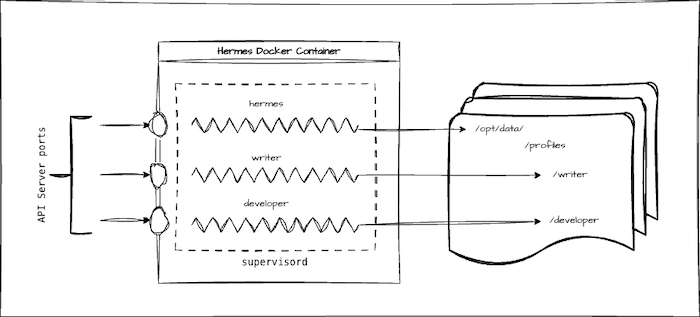

# Hermes Docker with Multi-agent support (Profiles)

A Docker packaging layer for [Hermes Agent](https://nousresearch.com) that adds multi-agent support via supervisor. A single container can run one main Hermes instance plus any number of named profile instances in parallel, all sharing the same image.


---

## Hermes Docker: Multi-Profile Architecture Options

The base Hermes Agent Docker image does not support multiple profiles within a single container natively. For additional profiles, only `chat` is available — cron jobs and messaging integrations are not supported.

Two approaches exist for running a multi-profile Hermes environment:

---

## Approach 1: Separate Docker Instance per Profile

Each profile runs in its own dedicated Docker container. A shared directory can optionally be mounted across instances.

### Advantages

- **Full isolation** — each instance has its own processes, database, memory, and cron jobs
- **Simple deployment** — standard `docker run` per profile, no internal complexity
- **Fault containment** — a crash or error in one instance does not affect others
- **Per-profile resource limits** — easy to configure `container_cpu` and `container_memory` independently


### Disadvantages

- **Higher resource consumption** — each instance runs its own Python process, etc.
- **Higher administrative effort** - if you need many profiles

---

## Approach 2: Single Docker Container with supervisord (Multiple Gateway Processes)

A single Docker container runs multiple `hermes gateway` processes managed by `supervisord`. This approach is   straightforward to implement — no changes to the Hermes codebase are required, only the Docker startup scripts need to be changed.

### Advantages

- **Already working** — supervisord makes this easy to implement without modifying Hermes internals
- **Single container to manage** — one image, one update cycle, one deployment unit
- **Process supervision included** — supervisord handles automatic restarts  
- **Shared Python environment** — lower resource overhead compared to Approach 1
 

### Disadvantages

- **Weaker isolation** — a container crash or restart affects all profiles simultaneously
- **No per-profile resource limits** — CPU and memory limits apply to the entire container, not individual profiles
 
---
 


## Purpose

This project implements the **Approach 2**.

The base `nousresearch/hermes-agent` image runs a single Hermes gateway. This wrapper adds:

- **UID/GID remapping** so the data volume and install directory are writable by the host user without permission errors
- **Supervisor process management** so the main instance and every profile instance are kept alive automatically
- **Profile auto-discovery** — scans subdirectories under `/opt/data/profiles/` and registers each as its own supervised process on the next container start.



---

## How it works

### Startup sequence (`entrypoint.sh`)

When the container starts, `entrypoint.sh` runs as root and performs these steps in order:

1. **`remap-ownership.sh`** — If `HERMES_UID` / `HERMES_GID` are set and differ from the current `hermes` user/group IDs, the user and group are remapped with `usermod`/`groupmod`, and both `HERMES_HOME` and `INSTALL_DIR` are `chown`-ed to `hermes`. In rootless Podman environments where `chown` would fail, the error is silently ignored.

2. **Supervisor config directory** — `/etc/supervisor/conf.d/` is created.

3. **Main instance config** — A supervisor program definition `hermes-main.conf` is generated, pointing `start.sh gateway run` at `HERMES_HOME=/opt/data`.

4. **Profile instance configs** — Every subdirectory found under `/opt/data/profiles/` gets its own `hermes-profile-<name>.conf` program definition. Each profile gets its own `HERMES_HOME`.  

5. **`supervisord` starts** — `exec supervisord` replaces the shell process. From this point, supervisor owns all child processes.

### Per-instance launcher (`start.sh`)

Supervisor calls `start.sh` for each program. It:

- Activates the Python virtualenv from `INSTALL_DIR`
- Creates the required directory layout inside `HERMES_HOME` (`cron`, `sessions`, `logs`, `hooks`, `memories`, `skills`, `skins`, `plans`, `workspace`, `home`)
- Seeds missing config files (`.env`, `config.yaml`, `SOUL.md`) from bundled examples
- Syncs bundled skills via `skills_sync.py`
- Runs `hermes gateway run` for the main instance, or `hermes -p <profile> gateway run` for profile instances

### Supervisor (`supervisord.conf`)

Supervisor runs in the foreground (`nodaemon=true`) so Docker captures all log output directly from stdout/stderr. It picks up all `*.conf` files from `/etc/supervisor/conf.d/`, which are generated dynamically by `entrypoint.sh` at runtime.

---

## Build and use

### Configuration (`.env`)

All image, container, and runtime variables are defined in `.env` at the project root. Copy `.env.example` to get started:

```bash
cp .env.example .env
```

```dotenv
IMAGE_NAME=hermes-multiagent
CONTAINER_NAME=hermes-test

TZ=Europe/Berlin
HERMES_UID=1000
HERMES_GID=1000
```

`docker compose` reads this file automatically. The `Makefile` loads it via `include .env`.

| Variable | Description |
|---|---|
| `IMAGE_NAME` | Docker image tag used by `make build` and `docker compose` |
| `CONTAINER_NAME` | Container name used by `docker compose` and `make` shell targets |
| `TZ` | Container timezone |
| `HERMES_UID` | Remap the `hermes` user to this UID (match your host user) |
| `HERMES_GID` | Remap the `hermes` group to this GID (match your host user) |

Runtime-only variables (set inside the container, not in `.env`):

| Variable | Default | Description |
|---|---|---|
| `HERMES_HOME` | `/opt/data` | Data directory for the main instance |
| `INSTALL_DIR` | `/opt/hermes` | Hermes installation directory inside the image |

### Build the image

```bash
make build
# equivalent to:
docker buildx build -t $IMAGE_NAME .
```

### Start with Docker Compose

```bash
make up
# equivalent to:
docker compose up -d
```

If you change the user (`HERMES_UID` and `HERMES_GID`), the first startup takes longer.

The compose file mounts `~/apps/data/.hermes_test` as `/opt/data`. On first start, Hermes populates the data folder and starts the main gateway process.

Create a `.bashrc` in the data folder (e.g. `~/apps/data/.hermes_test`) to activate the virtualenv in interactive shells:

```bash
export PATH="$HOME/.local/bin:$PATH"
source /opt/hermes/.venv/bin/activate
```

### Setup Hermes

Log in to the container:

```bash
make bash
```

You can now configure Hermes.

### Add a profile

Create the profile:

```bash
hermes profile create writer --clone
```

The main configuration is cloned to `/opt/data/profiles/writer` (= `~/apps/data/.hermes_test/profiles/writer`).

Update the configuration for this profile, then restart the container:

```bash
make restart
```

`entrypoint.sh` detects the new directory and registers it as a supervised `hermes-writer` process. The profile is then available via the `writer` CLI.

### Manage the gateway processes

Processes are managed by `supervisorctl` inside the container. Connect with `make sh-root`, then:

```bash
# List all processes and their status
supervisorctl status

# Stop / start / restart the main instance
supervisorctl stop  hermes-main
supervisorctl start hermes-main
supervisorctl restart hermes-main

# Stop / start / restart a profile instance (e.g. "writer")
supervisorctl stop  hermes-writer
supervisorctl start hermes-writer
supervisorctl restart hermes-writer

# Restart everything at once
supervisorctl restart all
```

Process names follow the pattern `hermes-main` for the default instance and `hermes-<profile>` for each profile directory found under `/opt/data/profiles/`.

---

## Enable API Server

The API server is configured per instance via the Hermes `.env` file inside each instance's data directory (e.g. `~/apps/data/.hermes_test/.env` for the main instance, `~/apps/data/.hermes_test/profiles/writer/.env` for a profile).

Add the following to the relevant `.env`:

```dotenv
API_SERVER_ENABLED=true
API_SERVER_KEY=<your-key>
API_SERVER_HOST=0.0.0.0
API_SERVER_PORT=<internal_port>
```

Each instance must use a unique port. Add a corresponding port mapping to `docker-compose.yaml`:

```yaml
ports:
  - <external_port>:<internal_port>
```

---

## Limitations

- Hermes WebUI does not know about profiles
- Not tested with different messaging platforms

---

## Makefile targets

| Command | Description |
|---|---|
| `make up` | Start all containers |
| `make down` | Stop and remove containers |
| `make start` | Start stopped containers |
| `make stop` | Stop running containers (without removing them) |
| `make restart` | Restart containers |
| `make logs` | Stream logs |
| `make status` | Show container status |
| `make clean` | Stop containers and remove volumes |
| `make bash` | Open bash shell as `hermes` user |
| `make sh-root` | Open shell as root |
| `make build` | Build the image (tagged `IMAGE_NAME`) |
